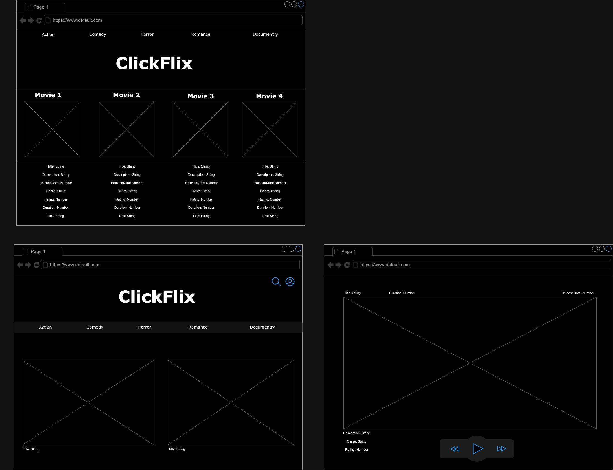

# ClickFlix_Full_Stack

"Introducing **'ClickFlix'** - your gateway to unlimited free movie entertainment! With ClickFlix, you can browse through a curated selection of top-quality movies available for free on YouTube. Simply open the app, pick your preferred genre or a specific title, and start enjoying your favorite movies without any subscription fees. Whether you're into classic films, indie gems, or the latest blockbusters, ClickFlix has something for everyone.

- I want to browse a curated selection of free YouTube movies so that I can easily find something to watch.

- I want to search for movies by title, genre, or release date so that I can quickly find movies that match my interests.

- I would like to watch movies directly within the app without being redirected to YouTube, providing a seamless viewing experience.

- I would like to be able to save movies to my watchlist so that I can easily access them later.

- I want to see details about each movie, including its title, description, genre, release date, and rating, to help me decide whether to watch it.

- I would like to be able to rate and review movies after watching them, allowing me to share my thoughts and experiences with others.

- I want to be able to add, edit, and remove movies from the platform, ensuring that the content remains up-to-date and relevant to users.

**Technologies Used:**

- Node/Express/MongoDB

- JavaScript

- HTML

- Github

- ChatGPT

- codeium

- google/google fonts

- image preview

- Trello

## Next Steps ##

- finish planning

- get started on server and DB/ backend

- work on populating the DB

- add controllers and actions

- HTML/frontend

- syncing frontend to backend

- testing and debugging any and eveyrtime

